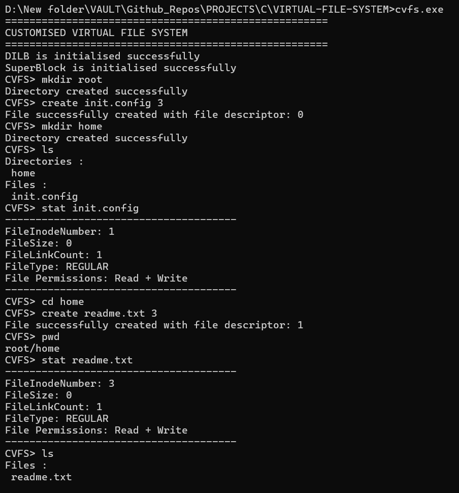

# Customised Virtual File System (CVFS) in C

## Project Overview

This project implements a **Customised Virtual File System (CVFS) in C language** that simulates core UNIX/Linux file system behavior entirely in memory. In addition to basic file operations such as creating, reading, writing, truncating, and deleting files, the system now supports a **hierarchical directory structure**, similar to a real-world Linux file system.

The CVFS uses custom-designed data structures like **SuperBlock, Inode, FileTable, UFDT**, and newly added **directory-specific structures** to manage files and directories efficiently.

---

## Role of the Customised Virtual File System (CVFS)

The Customised Virtual File System (CVFS) acts as an abstraction layer between user-level programs and underlying file system implementations. It provides a consistent interface for file and directory operations (such as `open`, `read`, `write`, `mkdir`, and `ls`), allowing the operating system to manage storage objects uniformly.

This modular design simplifies file handling logic, improves extensibility, and helps in understanding how real file systems like **ext4** internally manage directories, files, and metadata.

---

## Tech Stack

| Technology / Concept      | Description |
|---------------------------|-------------|
| **C Language**            | Core programming language used to implement filesystem logic |
| **GCC Compiler**          | Used to compile and build the project |
| **Data Structures**       | SuperBlock, Inode, FileTable, UFDT, Dnode, SDnode, Dfile |
| **UNIX/Linux Concepts**   | Inode-based file system design and directory hierarchy |
| **In-Memory FS**          | Entire filesystem operates without disk I/O |

---

## How to Compile and Run

### Compilation (Windows/Linux)

```bash
gcc VFS_Functions.c VirtualFileSystem.c -o mycvfs
```

### Run the program

```bash
./mycvfs
```

---

## Command List

| Command      | Use Case |
|--------------|----------|
| `ls`         | List files and directories in current directory |
| `mkdir`      | Create a new directory |
| `rmdir`      | delete a empty directory |
| `cd`         | Change current working directory |
| `pwd`        | Display current directory path |
| `create`     | Create a new file |
| `open`       | Open an existing file |
| `read`       | Read data from a file |
| `write`      | Write data to a file |
| `truncate`   | Clear file contents |
| `rm`         | Delete a file |
| `stat`       | Show file metadata using filename |
| `fstat`      | Show file metadata using file descriptor |
| `offset`     | Display read/write offsets |
| `closeall`   | Close all open files |
| `cls`        | Clear console |
| `exit`       | Exit the CVFS shell |

---

## Internal Architecture

| Component   | Description |
|-------------|-------------|
| **SuperBlock** | Tracks total and free inodes |
| **Inode**      | Stores metadata and links to data blocks |
| **FileTable**  | Maintains file offsets and access modes |
| **UFDT**       | Maps file descriptors to FileTable entries |
| **Dnode**      | Represents a directory node |
| **SDnode**     | Linked list of sub-directories |
| **Dfile**      | Maps filenames to inode numbers |

---

## Directory Structure Support

The CVFS supports a **tree-based directory hierarchy** with the following features:

- Root directory (`/`)
- Nested sub-directories
- Files mapped to directories using Dfile entries
- Current Working Directory (CWD) support

This design closely models Linux directory internals.

---

## Screenshots

### Command-Line Interface



---

## Author

Developed and maintained by **Prem Choudhary**.

This project is intended for academic learning, operating system concept understanding, and interview preparation.

---

## Future Installation

- Persistent storage (save/load filesystem state)
- Recursive directory deletion
- Directory-level permissions
- Shell scripting support
- Larger file size support

---

## License

This project is licensed under the [MIT License](LICENSE).